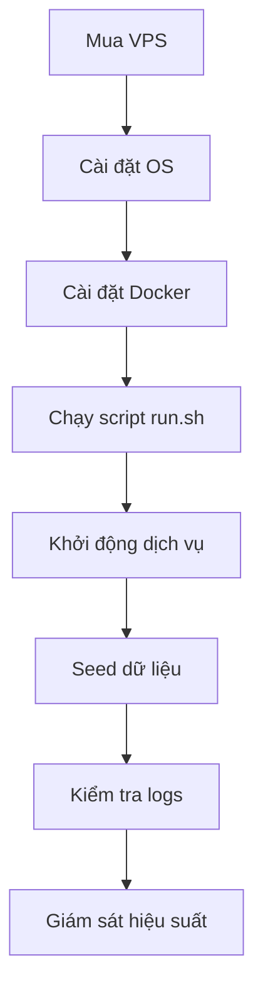

# Kế hoạch triển khai tự động hóa cho VPS mới

## **Mục tiêu**
- Tạo một bản build chuẩn cho 2 dịch vụ chính:
  1. **Website doanh nghiệp**: Có khả năng tự chủ, dễ dàng triển khai.
  2. **n8n**: Workflow automation, giảm chi phí vận hành.
- Đơn giản hóa quy trình triển khai: Chỉ cần chạy một script `.sh` để launch toàn bộ hệ thống.

---

## **Chi tiết kế hoạch**

### **1. Chuẩn bị môi trường**
1. **Mua VPS**:
   - Lựa chọn VPS phù hợp với tài nguyên cần thiết (CPU, RAM, dung lượng).
2. **Cài đặt hệ điều hành**:
   - Hỗ trợ các hệ điều hành Linux phổ biến: **Ubuntu**, **Rocky**, **CentOS**.
3. **Cài đặt Docker**:
   - Cài đặt Docker và Docker Compose để quản lý container.

---

### **2. Cấu hình dịch vụ**
#### **Website doanh nghiệp (Next.js)**
- **Dockerfile**:
  - Build ứng dụng Next.js với các bước tối ưu hóa layer.
- **docker-compose.yml**:
  - Cấu hình cổng, biến môi trường (`NEXT_PUBLIC_API_URL`, `NEXT_WEBSITE_URL`).
  - Giới hạn tài nguyên (CPU, RAM).

#### **n8n**
- **Dockerfile**:
  - Sử dụng image chính thức của n8n.
- **docker-compose.yml**:
  - Cấu hình webhook, cơ sở dữ liệu PostgreSQL.
  - Tích hợp SMTP để gửi email.

---

### **3. Tự động hóa triển khai**
#### **Script `run.sh`**
- **Chức năng**:
  1. Cài đặt Docker nếu chưa có.
  2. Build và chạy các container từ `docker-compose.yml`.
  3. Kiểm tra logs và trạng thái container.
- **Cấu trúc**:
  ```bash
  #!/bin/bash
  echo "Cài đặt Docker..."
  # Cài đặt Docker nếu chưa có
  if ! [ -x "$(command -v docker)" ]; then
    curl -fsSL https://get.docker.com -o get-docker.sh
    sh get-docker.sh
  fi

  echo "Khởi động dịch vụ..."
  docker compose up -d --build

  echo "Kiểm tra trạng thái container..."
  docker ps
  ```

---

### **4. Seed dữ liệu**
#### **Strapi**
- **Script `check-and-seed.js`**:
  - Kiểm tra dữ liệu qua API `/api/global`.
  - Nếu không có dữ liệu, seed từ file backup:
    ```bash
    yarn strapi import -f ./data/export_20250116105447.tar.gz --force
    ```
- **Tích hợp vào `run.sh`**:
  - Thêm bước chạy script seed sau khi khởi động container.

---

### **5. Tối ưu hóa**
- **Caching**:
  - Cache Docker layers để tăng tốc độ build.
- **Giới hạn tài nguyên**:
  - Đặt giới hạn CPU, RAM trong `docker-compose.yml`.
- **Bảo mật**:
  - Mã hóa secrets và quét lỗ hổng bảo mật với Trivy.

---

### **6. Kiểm tra và giám sát**
- **Health Check**:
  - Thêm bước kiểm tra sức khỏe container (`docker inspect`).
- **Logging**:
  - Tích hợp Fluentd + Loki để quản lý logs.
- **Monitoring**:
  - Sử dụng Prometheus và Grafana để theo dõi hiệu suất.

---

### **Sơ đồ triển khai**


---

## **Hướng dẫn sử dụng**
1. SSH vào VPS mới.
2. Clone repo:
   ```bash
   git clone <repo-url>
   cd <repo-folder>
   ```
3. Chạy script:
   ```bash
   bash run.sh
   ```
4. Truy cập website tại `http://<IP-VPS>`.
